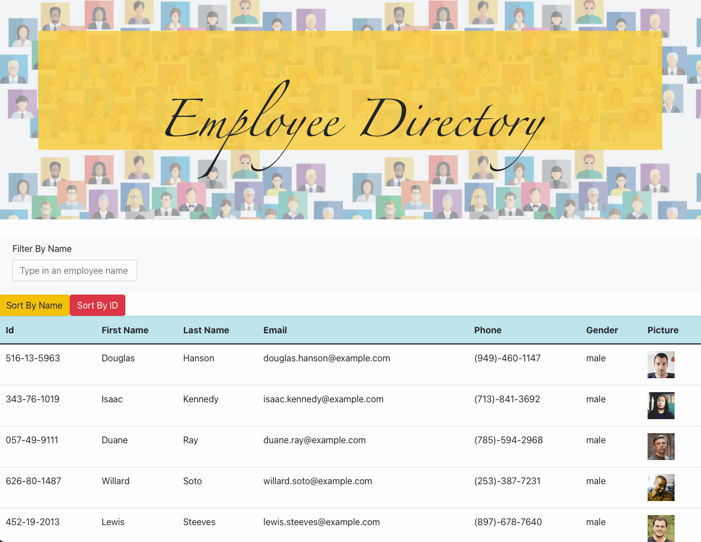

<h1 align= "center"> :office: Employee Directory :office: <h1>


### :bar_chart: Table of Contents:

- [Description](#Description)

- [Visuals](#Visuals)

- [Installation](#Installation)

- [Usage](#Usage)

- [Contributing](#Contributing)

- [Profile](#Profile)

### Description:

```
Employee Directory with React. When the user loads the page, a table of employees should render.

The user should be able to:
Sort the table by at least one category
Filter the users by at least one property.
```

### Visuals:

 <br>

### Installation:

:computer: This project was bootstrapped with [Create React App](https://github.com/facebook/create-react-app).

### Available Scripts

In the project directory, you can run:

`npm start`

```
Runs the app in the development mode.\
Open [http://localhost:3000](http://localhost:3000) to view it in the browser.

The page will reload if you make edits.\
You will also see any lint errors in the console.
```

`npm test`

Launches the test runner in the interactive watch mode.\
See the section about [running tests](https://facebook.github.io/create-react-app/docs/running-tests) for more information.

`npm run build`

```
Builds the app for production to the `build` folder.\
It correctly bundles React in production mode and optimizes the build for the best performance.
```

The build is minified and the filenames include the hashes.\
Your app is ready to be deployed!

```
See the section about [deployment](https://facebook.github.io/create-react-app/docs/deployment) for more information.
```

`npm run eject`

:bangbang: **Note: this is a one-way operation. Once you `eject`, you can’t go back!**

```
If you aren’t satisfied with the build tool and configuration choices, you can `eject` at any time. This command will remove the single build dependency from your project.
```

```
Instead, it will copy all the configuration files and the transitive dependencies (webpack, Babel, ESLint, etc) right into your project so you have full control over them. All of the commands except `eject` will still work, but they will point to the copied scripts so you can tweak them. At this point you’re on your own.
```

```
You don’t have to ever use `eject`. The curated feature set is suitable for small and middle deployments, and you shouldn’t feel obligated to use this feature. However we understand that this tool wouldn’t be useful if you couldn’t customize it when you are ready for it.
```

### Learn More

:pencil: You can learn more in the `[Create React App documentation]` `(https://facebook.github.io/create-react-app/docs/getting-started)`.

:book: To learn React, check out the `[React documentation](https://reactjs.org/)`.

### Code Splitting

This section has moved here: ` [https://facebook.github.io/create-react-app/docs/code-splitting]``(https://facebook.github.io/create-react-app/docs/code-splitting) `

### Analyzing the Bundle Size

```
This section has moved here: [https://facebook.github.io/create-react-app/docs/analyzing-the-bundle-size](https://facebook.github.io/create-react-app/docs/analyzing-the-bundle-size)
```

### Making a Progressive Web App

```
This section has moved here: [https://facebook.github.io/create-react-app/docs/making-a-progressive-web-app](https://facebook.github.io/create-react-app/docs/making-a-progressive-web-app)
```

### Advanced Configuration

```
This section has moved here: [https://facebook.github.io/create-react-app/docs/advanced-configuration](https://facebook.github.io/create-react-app/docs/advanced-configuration)
```

### Deployment

```
This section has moved here: [https://facebook.github.io/create-react-app/docs/deployment](https://facebook.github.io/create-react-app/docs/deployment)
```

`npm run build` fails to minify

```
This section has moved here: [https://facebook.github.io/create-react-app/docs/troubleshooting#npm-run-build-fails-to-minify](https://facebook.github.io/create-react-app/docs/troubleshooting#npm-run-build-fails-to-minify)
```

### Usage:

:exclamation: `npm run start`

### Contributing:

:wave: Pull requests are welcome. For major changes,<br>
Please open an issue first to discuss what you would like to change.<br>
Please make sure to update tests as appropriate.

### Profile:

:octocat: [GitHub](https://github.com/adpir/React_Employee_Directory)<br>

:octocat: [Deployed] (https://adpir.github.io/React_Employee_Directory)
